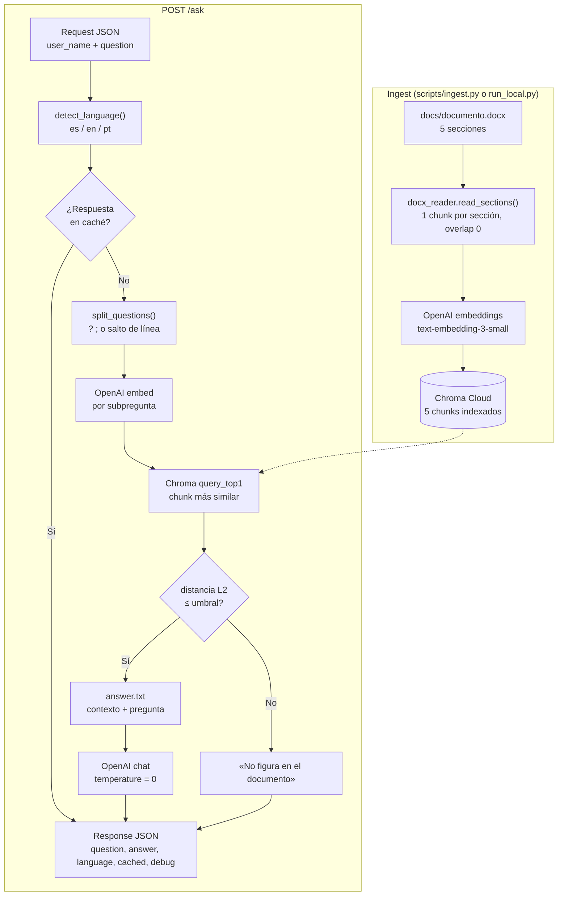

# Documentación de la API

Base URL local: **[http://localhost:8000](http://localhost:8000)**

La API responde preguntas sobre `docs/documento.docx` usando RAG:

1. Convierte la pregunta en un embedding y busca el fragmento más parecido en Chroma.
2. Envía ese fragmento como contexto al LLM (OpenAI).
3. Devuelve una respuesta en una oración, en el mismo idioma que la pregunta.

El documento tiene **5 secciones** → **5 chunks** en Chroma (uno por sección).



---

## Endpoints


| Método | Ruta      | Para qué sirve                                |
| ------ | --------- | --------------------------------------------- |
| `GET`  | `/health` | Ver si la API está activa y el índice cargado |
| `POST` | `/ask`    | Hacer una pregunta sobre el documento         |


---

## GET /health

Comprobá que todo esté listo antes de preguntar.

**Ejemplo de respuesta (200 OK):**

```json
{
  "status": "ok",
  "indexed_chunks": 5,
  "corpus_path": "docs/documento.docx",
  "chroma_database": "tu_database_name",
  "chroma_collection": "tu_coleccion_name"
}
```

`indexed_chunks` debería ser **5** después del ingest.

---

## POST /ask

### Request

Header: `Content-Type: application/json`

Solo se aceptan `**user_name`** y `**question**`. Cualquier otro campo devuelve **422**.

```json
{
  "user_name": "John Doe",
  "question": "Quien es Zara?"
}
```


| Campo       | Descripción                                     |
| ----------- | ----------------------------------------------- |
| `user_name` | Nombre del usuario (requerido por el challenge) |
| `question`  | Pregunta sobre el contenido del documento       |


### Response (200 OK)

```json
{
  "question": "Quien es Zara?",
  "answer": "respuesta a quien es Zara extrida del documento.",
  "language": "es",
  "cached": false,
  "debug": {
    "chunk_id": "id-chunk",
    "section_title": "Título de sección",
    "retrieval_distance": 1.02,
    "retrieval_threshold": 1.77
  }
}
```


| Campo      | Descripción                                              |
| ---------- | -------------------------------------------------------- |
| `question` | La pregunta que enviaste                                 |
| `answer`   | Respuesta del LLM (una oración, tercera persona, emojis) |
| `language` | Idioma detectado: `es`, `en` o `pt`                      |
| `cached`   | `true` si es la misma respuesta que ya se había guardado |
| `debug`    | Datos del chunk usado y distancia de similitud           |


Si repetís **exactamente** la misma pregunta, `cached` pasa a `true` y la respuesta no cambia.

Si la pregunta no está en el documento, la API responde con un mensaje del tipo *«no figura en el documento»* (en el idioma de la pregunta).

### Response (422 Unprocessable Entity)

Body inválido: campo mal escrito, faltante o extra. Ejemplo usando `username` en lugar de `user_name`:

**Request incorrecto:**

```json
{
  "username": "Jhon Doe",
  "question": "quien es Zara?"
}
```

**Response:**

```json
{
  "detail": [
    {
      "type": "missing",
      "loc": ["body", "user_name"],
      "msg": "Field required",
      "input": {
        "username": "Jhon Doe",
        "question": "quien es Zara?"
      }
    },
    {
      "type": "extra_forbidden",
      "loc": ["body", "username"],
      "msg": "Extra inputs are not permitted",
      "input": "Solano"
    }
  ]
}
```

---

## Códigos HTTP habituales


| Código  | Significado                             |
| ------- | --------------------------------------- |
| **200** | Todo bien                               |
| **422** | Body inválido (campo faltante o extra)  |
| **500** | Error de configuración (API keys, etc.) |
| **503** | Corpus o índice no disponible           |


---

## Preguntas de prueba

- `Quien es Zara?`
- `What did Emma decide to do?`
- `What is the name of the magical flower?`

---

## Postman

Documentación publicada con ejemplos de request/response:

**[Colección para el Challenge AI — PI Consulting](https://documenter.getpostman.com/view/46472328/2sBXwjwZZa)**

Para ejecutar los requests contra tu API local, importá la colección desde el [README](./README.md#postman-recomendado) y usá **Postman Desktop** (no la versión web).

---

## Prompt

El prompt del LLM está en `src/prompts/answer.txt`.