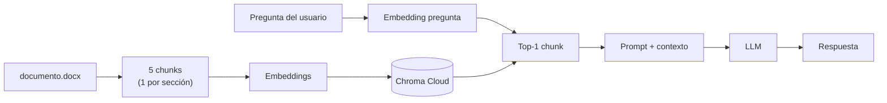
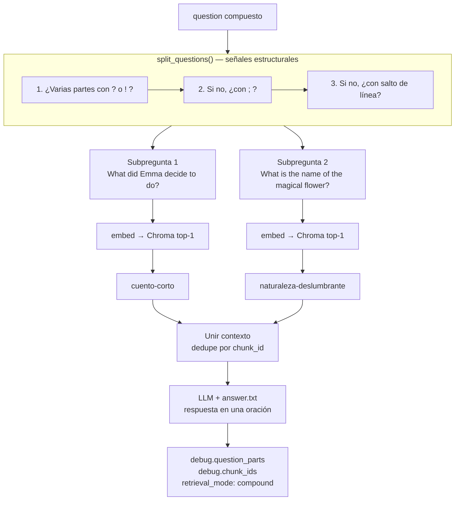
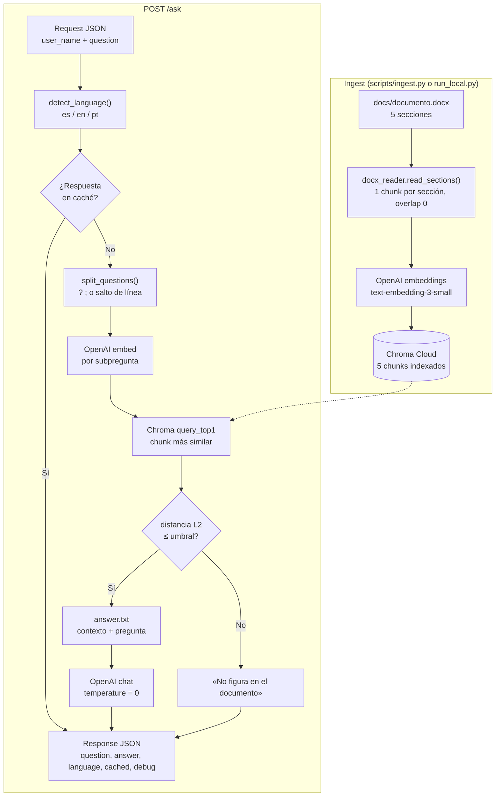

# PI Challenge — RAG API

API en FastAPI que responde preguntas sobre el documento `docs/documento.docx`.

## Índice

- [La herramienta](#la-herramienta)
  - [Arquitectura](#arquitectura)
  - [Por qué 5 chunks (uno por sección)](#por-qué-5-chunks-uno-por-sección)
  - [Por qué separamos preguntas compuestas](#por-qué-separamos-preguntas-compuestas)
  - [Flujo de sub-preguntas](#flujo-de-sub-preguntas)
  - [Flujo completo (ingest + POST /ask)](#flujo-completo-ingest--post-ask)
- [Requisitos](#requisitos)
- [Instalación](#instalación)
- [Variables de entorno](#variables-de-entorno)
- [Cómo correr el proyecto](#cómo-correr-el-proyecto)
  - [Opción 1 — Local](#opción-1--local-recomendado) 
  - [Opción 2 — Docker](#opción-2--docker)
- [Probar que funciona](#probar-que-funciona)
  - [Postman](#postman-recomendado)
  - [curl](#curl)
- [Documentación de la API](#documentación-de-la-api)

## La herramienta

Servicio RAG local que recibe una pregunta por HTTP, busca el fragmento más relevante del documento en **Chroma Cloud** (similitud vectorial con embeddings de **OpenAI**) y genera la respuesta con un LLM siguiendo las reglas del challenge (una oración, tercera persona, emojis, mismo idioma que la pregunta).

Flujo resumido: **ingest** del `.docx` → **embedding** de cada chunk → **consulta** por pregunta → **prompt** con contexto → **respuesta** (con caché en memoria para repetir la misma pregunta).




### Arquitectura

El código sigue una **arquitectura en capas** (`api` → `services` → `infra`), inspirada en Clean Architecture: la API expone HTTP, `services` concentra la lógica RAG y `infra` encapsula OpenAI, Chroma y el procesamiento del `.docx`. Decidí no usar interfaces formales (ports/adapters) para priorizar claridad y operabilidad, dado el contexto acotado del challenge.


| Capa            | Carpeta         | Responsabilidad                             |
| --------------- | --------------- | ------------------------------------------- |
| Presentación    | `src/api/`      | Rutas, validación Pydantic, códigos HTTP    |
| Lógica          | `src/services/` | Ingest, retrieval, sub-preguntas, respuesta |
| Infraestructura | `src/infra/`    | OpenAI, Chroma, docx, caché, prompt         |


Orquestación principal en `src/services/answer_question.py`.

### Por qué 5 chunks (uno por sección)

El texto de `docs/documento.docx` tiene **5 párrafos** (aprox. 330 palabras), cada uno con formato `Título: cuerpo`. Cada párrafo es un tema independiente:


| Sección                            | Chunk en Chroma                      | Preguntas de prueba (ejemplo)             |
| ---------------------------------- | ------------------------------------ | ----------------------------------------- |
| Ficción Espacial                   | `ficcion-espacial`                   | `Quien es Zara?`                          |
| Ficción Tecnológica                | `ficcion-tecnologica`                | —                                         |
| Naturaleza Deslumbrante            | `naturaleza-deslumbrante`            | `What is the name of the magical flower?` |
| Cuento Corto                       | `cuento-corto`                       | `What did Emma decide to do?`             |
| Características del Héroe Olvidado | `caracteristicas-del-heroe-olvidado` | —                                         |


**Decisión:** 1 chunk por sección, **sin overlap** (0).

- Las preguntas de prueba del challenge apuntan **una por párrafo** (ver tabla) y comparten formato y tamaño similar → 5 chunks alcanzan.
- El documento es corto (330 palabras aprox., 5 párrafos similares en tamaño y estructura): partir más fino no aporta porque en este caso el documento ya viene segmentado por tema
- No usé ventana fija de tokens ni overlap: las secciones no se solapan temáticamente y no mejoraría el retrieval.
- Chunks más grandes (por ejemplo, todo el documento en un solo chunk) mezclarian contextos distintos y empeorarían el top1.
- Las preguntas que cruzan secciones las cubrí con **sub-preguntas** (ver más abajo), no con más chunks.
- Con 5 chunks, el top-1 por embedding suele traer el bloque correcto para preguntas simples.

### Por qué separamos preguntas compuestas

Con **un solo embedding** sobre todo el mensaje, Chroma devuelve **un único chunk**, el más parecido al texto completo, no a cada tema. En un mensaje como *"What did Emma decide to do? What is the name of the magical flower?"* eso suele fallar: Emma está en un párrafo y la flor en otro.

**Decisión:** detectar varias preguntas en el mismo `question` y hacer **un retrieval por subpregunta** (`src/services/question_splitter.py`).

Cómo se separan (solo señales **estructurales**, sin listas de palabras clave):

1. Signos `?` o `!` → `pregunta 1? pregunta 2?`
2. Punto y coma → `pregunta 1; pregunta 2`
3. Saltos de línea

Cada parte se embedea y consulta su top-1; los chunks se unen en un solo contexto para el LLM, que responde **en una oración** si el prompt lo pide.

### Flujo de sub-preguntas

Ejemplo: *"What did Emma decide to do? What is the name of the magical flower?"*




Sin este paso, un solo embedding sobre todo el mensaje suele recuperar **un solo chunk** (el más parecido al texto completo), no uno por tema.

Convención recomendada para el usuario: `**pregunta 1? pregunta 2?`**. En la respuesta API, `debug.question_parts` y `debug.chunk_ids` muestran cómo se partió el mensaje.

### Flujo completo (ingest + POST /ask)




## Requisitos

- Python 3.11+
- Cuenta en [OpenAI](https://platform.openai.com/) (API key)
- Cuenta en [Chroma Cloud](https://www.trychroma.com/) (API key, tenant y database)
- Docker y Docker Compose *(solo si vas a correr con Docker)*

## Instalación

```bash
git clone https://github.com/solanodz/pi_challenge_ai.git
cd pi_challenge_ai

python -m venv .venv
source .venv/bin/activate          # Windows: .venv\Scripts\activate

pip install -r requirements.txt
cp .env.example .env
```

Editá `.env` con tus credenciales (ver tabla abajo).

## Variables de entorno

Copiá `.env.example` a `.env` y completá cada valor:


| Variable                 | Qué es                                                                      |
| ------------------------ | --------------------------------------------------------------------------- |
| `OPENAI_API_KEY`         | Tu API key de OpenAI                                                        |
| `OPENAI_CHAT_MODEL`      | Modelo de chat (ej. `gpt-4o-mini`)                                          |
| `OPENAI_EMBEDDING_MODEL` | Modelo de embeddings (`text-embedding-3-small`)                             |
| `CORPUS_PATH`            | Ruta al documento (default: `docs/documento.docx`)                          |
| `CHROMA_API_KEY`         | API key de Chroma Cloud                                                     |
| `CHROMA_TENANT`          | Tenant ID de Chroma Cloud                                                   |
| `CHROMA_DATABASE`        | Nombre de la base en Chroma                                                 |
| `CHROMA_COLLECTION`      | Nombre de la colección donde se guardan los chunks                          |
| `RETRIEVAL_DISTANCE_MAX` | Umbral de similitud (default: `1.77`; no hace falta cambiarlo para empezar) |


Las credenciales de Chroma las encontrás en el dashboard de Chroma Cloud.

## Cómo correr el proyecto

### Opción 1 — Local

Un comando carga el documento en Chroma y levanta la API:

```bash
python scripts/run_local.py --reload
```

Si ya corriste el ingest antes y solo querés la API:

```bash
python scripts/run_local.py --skip-ingest --reload
```

La API queda en **[http://localhost:8000](http://localhost:8000)**.

### Opción 2 — Docker

Asegurate de tener el `.env` configurado y ejecutá:

```bash
docker compose up --build
```

La API queda en **[http://localhost:8000](http://localhost:8000)**. El contenedor hace el ingest automáticamente al arrancar.

Para arrancar sin re-ingestar (más rápido, si el índice ya existe en Chroma):

```bash
SKIP_INGEST=true docker compose up --build
```

## Probar que funciona

Con la API corriendo en **[http://localhost:8000](http://localhost:8000)**:

### Postman

Usá **Postman Desktop** (app instalada), no la versión web: desde el navegador no se puede llamar a `http://localhost:8000`.

- **[Documentación pública en Postman Documenter](https://documenter.getpostman.com/view/46472328/2sBXwjwZZa)** — descripción de endpoints y ejemplos.
- **[Importar colección](https://solanodezuasnabar.postman.co/workspace/b6a61666-0a49-4f66-86ba-61f100a90747/collection/46472328-13b9e234-892f-45a3-b7a0-2cba4942ee2c?action=share&source=copy-link&creator=46472328)** — requests listos para ejecutar.

Pasos:

1. Importá la colección en Postman Desktop (link de arriba).
2. Asegurate de que las requests apunten a `http://localhost:8000`.
3. Ejecutá **Health** y luego **Ask** (u otras requests de la colección).

### curl

```bash
curl http://localhost:8000/health
```

```bash
curl -X POST http://localhost:8000/ask \
  -H "Content-Type: application/json" \
  -d '{"user_name":"John Doe","question":"Quien es Zara?"}'
```

## Documentación de la API

Detalle de endpoints, códigos HTTP, ejemplos de request/response y campos: **[API.md](API.md)**.

Documentación interactiva en Postman: **[Colección para el Challenge AI — PI Consulting](https://documenter.getpostman.com/view/46472328/2sBXwjwZZa)**.